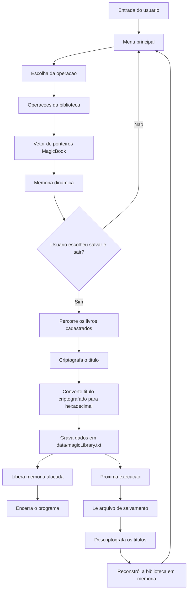

<div align="center">

# MAGIC LIBRARY

### Backend de Inventário de Livros Mágicos em C

`structs` · `ponteiros` · `alocação dinâmica` · `arquivos` · `criptografia`


</div>

---

```txt
+====================================================+
| MAGIC LIBRARY                                      |
| Enchanted Book Inventory                           |
+====================================================+
| Registered books: 000/100                          |
+----------------------------------------------------+
| [1] Register book                                  |
| [2] Delete book                                    |
| [3] Display book                                   |
| [4] Update book                                    |
| [5] List book titles                               |
| [6] Save and exit                                  |
+====================================================+
Choose an option:
```

---

## Navegação Rápida

| Seção | Descrição |
|:---:|---|
| [Visão Geral](#visão-geral) | Explicação geral do projeto |
| [Funcionalidades](#funcionalidades) | Opções do menu e operações do sistema |
| [Atributos de RPG](#atributos-de-rpg) | Atributos mágicos opcionais dos livros |
| [Estrutura do Projeto](#estrutura-do-projeto) | Organização das pastas e arquivos |
| [Como Compilar e Executar](#como-compilar-e-executar) | Comandos para Bash e PowerShell |
| [Modelo de Memória](#modelo-de-memória) | Como os livros são armazenados em memória |
| [Sistema de Salvamento](#sistema-de-salvamento) | Como funciona a persistência em arquivo |
| [Criptografia](#criptografia) | Como os títulos são protegidos |
| [Equipe](#equipe) | Integrantes do projeto |

---

## Visão Geral

**Magic Library** é um sistema de backend em C para gerenciar uma biblioteca de livros mágicos em um inventário fictício de RPG.

O projeto foi desenvolvido para aplicar conceitos fundamentais da linguagem C, como:

- `struct`
- ponteiros
- alocação dinâmica de memória
- vetor de ponteiros
- manipulação de arquivos
- criptografia de strings

Durante a execução, os livros ficam armazenados em memória. Quando o usuário escolhe salvar e sair, o programa grava os dados em um arquivo. Ao abrir o programa novamente com o mesmo arquivo, os livros são carregados de volta.

Dessa forma, o sistema simula um pequeno **save game** para o inventário da biblioteca mágica.

---

## Funcionalidades

| Opção | Ação | O que faz |
|:---:|:---:|---|
| `1` | Cadastrar livro | Aloca memória e armazena um novo livro mágico |
| `2` | Deletar livro | Busca um livro pelo ID, libera sua memória e limpa o espaço |
| `3` | Mostrar livro | Exibe todas as informações de um livro específico |
| `4` | Editar livro | Permite editar seletivamente título, autor, datas e atributos |
| `5` | Listar títulos | Mostra todos os IDs e títulos cadastrados |
| `6` | Salvar e sair | Salva a biblioteca em arquivo, libera a memória e encerra o programa |

O menu permanece em execução até que o usuário selecione a opção `6`.

---

## Atributos de RPG

Além dos dados obrigatórios do enunciado, cada livro pode possuir atributos opcionais de RPG.

Um livro **não precisa ter todos os atributos**. Por exemplo:

```txt
Livro A -> apenas MAG
Livro B -> FOR e CON
Livro C -> INT, SAB e MAG
```

Para controlar isso, cada atributo possui duas informações:

```txt
hasAttribute -> indica se o livro possui aquele atributo
value        -> armazena o valor do atributo
```

Atributos disponíveis:

| Código | Atributo | Significado |
|:---:|:---:|---|
| `FOR` | Força | Poder físico e potencial de combate corpo a corpo |
| `DES` | Destreza | Agilidade, reflexos e equilíbrio |
| `CON` | Constituição | Saúde, resistência e vigor |
| `INT` | Inteligência | Raciocínio, memória e conhecimento |
| `SAB` | Sabedoria | Intuição, instinto e percepção |
| `CAR` | Carisma | Presença, vontade e persuasão |
| `MAG` | Magia | Potencial mágico |

Cada atributo pode receber um valor de `1` a `20`.

---

## Estrutura do Projeto

```txt
mini-projeto-ip-magic-library/
├── data/
│   └── magicLibrary.txt
├── docs/
│   ├── test-cases.md
│   └── video-script.md
├── include/
│   ├── encryption.h
│   ├── files.h
│   ├── library.h
│   ├── structs.h
│   └── utils.h
├── src/
│   ├── encryption.c
│   ├── files.c
│   ├── library.c
│   ├── main.c
│   └── utils.c
├── build.ps1
├── build.sh
├── CMakeLists.txt
├── Makefile
└── README.md
```

Organização das pastas:

| Pasta | Função |
|:---:|---|
| `src/` | Arquivos-fonte `.c` |
| `include/` | Arquivos de cabeçalho `.h` |
| `data/` | Arquivo de salvamento utilizado pelo programa |
| `docs/` | Documentação auxiliar, casos de teste e roteiro do vídeo |

---

## Como Compilar e Executar

### Bash

Compilar:

```bash
bash build.sh
```

Executar:

```bash
./library data/magicLibrary.txt
```

### PowerShell

Compilar:

```powershell
.\build.ps1
```

Executar:

```powershell
.\library.exe data\magicLibrary.txt
```

Caso o PowerShell bloqueie a execução do script:

```powershell
powershell -ExecutionPolicy Bypass -File .\build.ps1
.\library.exe data\magicLibrary.txt
```

---

## Modelo de Memória

A biblioteca é armazenada em um vetor de `100` ponteiros.

```c
MagicBook *library[LIBRARY_SIZE];
```

Cada posição do vetor pode conter:

```txt
NULL               -> posição vazia
MagicBook pointer  -> livro alocado dinamicamente
```

Quando um livro é cadastrado, o programa procura uma posição livre e aloca memória usando `malloc`.

Quando um livro é deletado, o programa usa `free` para liberar a memória e depois define a posição como `NULL`.

Isso ajuda a evitar vazamentos de memória e mantém o inventário organizado.

---

## Sistema de Salvamento

O programa recebe o arquivo de salvamento pela linha de comando:

```bash
./library data/magicLibrary.txt
```

Quando o usuário escolhe a opção `6`, o programa:

1. Percorre o vetor da biblioteca.
2. Salva todos os livros cadastrados.
3. Criptografa o título de cada livro.
4. Grava os dados no arquivo `data/magicLibrary.txt`.
5. Libera toda a memória alocada dinamicamente.
6. Encerra o programa.

Quando o programa é aberto novamente usando o mesmo arquivo, os dados são carregados automaticamente.

---

## Criptografia

O título de cada livro é criptografado antes de ser salvo.

A criptografia usa o complemento de `255`:

```c
(char)(255 - (unsigned char)c)
```

Essa operação é reversível. Ou seja, aplicar a mesma lógica novamente descriptografa o texto.

Para evitar problemas com caracteres especiais em arquivos de texto, o título criptografado é salvo em formato hexadecimal.

---

## Funções Principais

| Módulo | Funções |
|:---:|---|
| `library.c` | `registerBook`, `deleteBookById`, `displayBookById`, `updateBookById`, `listBookTitles` |
| `files.c` | `saveLibraryToFile`, `loadLibraryFromFile` |
| `encryption.c` | `encryptString`, `decryptString` |
| `utils.c` | `clearInputBuffer`, `readLine`, `copyText`, `isValidDate` |

---

## Fluxo de Dados



---

## Guia de Testes

Testes recomendados:

| Teste | Resultado esperado |
|:---:|---|
| Cadastrar um livro | O livro aparece na listagem |
| Cadastrar ID duplicado | O sistema rejeita o ID |
| Mostrar livro existente | Todos os dados do livro são exibidos |
| Mostrar ID inexistente | Uma mensagem de erro é exibida |
| Editar apenas o título | Os outros campos permanecem iguais |
| Deletar livro | O livro é removido e a memória é liberada |
| Salvar e executar novamente | Os dados são carregados do arquivo |
| Adicionar apenas um atributo de RPG | Apenas esse atributo é exibido |

Casos de teste mais detalhados estão disponíveis em:

```txt
docs/test-cases.md
```

---

## Equipe

| Membro | Nome |
|:---:|---|
| Membro 1 | Saullo Luiz de Moura |
| Membro 2 | Manuela Renovato Amaral |

---

## Repositório

```txt
https://github.com/Euosaullo/mini-projeto-ip-magic-library
```

---

<div align="center">

**Magic Library**  
Um backend de inventário RPG em terminal desenvolvido em C.

</div>
