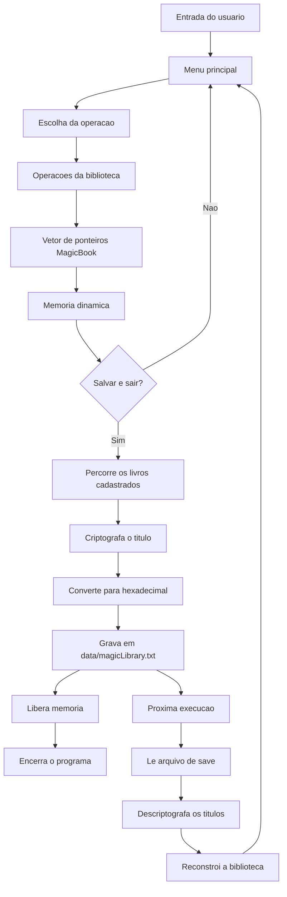

<div align="center">

# 📚 MAGIC LIBRARY

### Backend de Inventário de Livros Mágicos em C

<p>
  Um sistema em terminal para gerenciar livros mágicos, atributos de RPG,
  persistência em arquivo e criptografia de títulos.
</p>


</div>

---

## 🖥️ Prévia do Menu

```txt
+====================================================+
| MAGIC LIBRARY                                      |
| Enchanted Book Inventory                           |
+====================================================+
| Registered books: 000/100                          |
+----------------------------------------------------+
| [1] Register book                                  |
| [2] Delete book                                    |
| [3] Display book                                   |
| [4] Update book                                    |
| [5] List book titles                               |
| [6] Save and exit                                  |
+====================================================+
Choose an option:
```

---

## 🧭 Navegação

| Seção | Conteúdo |
|:---:|---|
| 🧾 [Visão Geral](#-visão-geral) | Explicação geral do projeto |
| ✨ [Funcionalidades](#-funcionalidades) | Opções do menu |
| 📖 [Dados do Livro](#-dados-do-livro) | Campos obrigatórios de cada livro |
| 🧙 [Atributos de RPG](#-atributos-de-rpg) | Sistema de atributos mágicos |
| 🏛️ [Perfil de Poder](#️-perfil-de-poder-do-livro) | Classificação, rank e arquétipo dos livros |
| 🗂️ [Estrutura](#️-estrutura-do-projeto) | Organização dos arquivos |
| ⚙️ [Compilação](#️-como-compilar-e-executar) | Bash e PowerShell |
| 🧠 [Memória](#-modelo-de-memória) | Como os livros são armazenados |
| 💾 [Salvamento](#-sistema-de-salvamento) | Persistência em arquivo |
| 🔐 [Criptografia](#-criptografia) | Proteção dos títulos |
| 🔄 [Fluxo](#-fluxo-de-dados) | Caminho dos dados no sistema |
| 👥 [Equipe](#-equipe) | Integrantes |

---

## 🧾 Visão Geral

**Magic Library** é um sistema de backend em C para gerenciar uma biblioteca de livros mágicos em um inventário fictício de RPG.
O projeto foi desenvolvido para aplicar conceitos fundamentais da linguagem C, como:

- `struct`
- ponteiros
- alocação dinâmica de memória
- vetor de ponteiros
- manipulação de arquivos
- criptografia de strings

Durante a execução, os livros ficam armazenados em memória. Quando o usuário escolhe salvar e sair, o programa grava os dados em um arquivo. Ao abrir o programa novamente com o mesmo arquivo, os livros são carregados de volta.
Dessa forma, o sistema simula um pequeno **save game** para o inventário da biblioteca mágica.

---

## ✨ Funcionalidades

| Opção | Ação | Descrição |
|:---:|:---:|---|
| `1` | 📘 Cadastrar livro | Aloca memória e registra um novo livro mágico |
| `2` | 🗑️ Deletar livro | Remove um livro pelo ID e libera a memória |
| `3` | 🔎 Mostrar livro | Exibe todos os dados de um livro específico |
| `4` | ✏️ Editar livro | Permite editar seletivamente título, autor, datas e atributos |
| `5` | 📋 Listar títulos | Mostra todos os IDs e títulos cadastrados |
| `6` | 💾 Salvar e sair | Salva os dados, libera memória e encerra o programa |

O menu permanece em execução até que o usuário selecione a opção `6`.

---

## 📖 Dados do Livro

Cada livro mágico possui um conjunto de informações básicas que representam sua identidade dentro da biblioteca.
Esses dados são os campos principais usados pelo sistema para cadastrar, buscar, exibir, editar, deletar, salvar e carregar livros.

| Campo | Tipo | Descrição |
|:---:|:---:|---|
| `id` | `int` | Identificador único do livro, usado para localizar o registro nas operações de busca, edição e deleção |
| `title` | `char[100]` | Título do livro mágico |
| `author.name` | `char[100]` | Nome do autor do livro |
| `author.birthDate` | `Date` | Data de nascimento do autor |
| `writingDate` | `Date` | Data em que o livro foi escrito |

A estrutura `Date` armazena datas no formato de dia, mês e ano:

```c
typedef struct
{
    int day;
    int month;
    int year;
} Date;
```

A estrutura `Author` agrupa os dados referentes ao autor:

```c
typedef struct
{
    char name[TEXT_SIZE];
    Date birthDate;
} Author;
```

A estrutura principal `MagicBook` representa um livro dentro da biblioteca:

```c
typedef struct
{
    int id;
    char title[TEXT_SIZE];
    Author author;
    Date writingDate;
    BookAttributes attributes;
} MagicBook;
```

Na prática, ao cadastrar um livro, o usuário informa:

```txt
Book ID
Book title
Author name
Author birth date
Writing date
```

Essas informações formam a base de cada registro. A partir delas, o sistema consegue identificar cada livro pelo `id`, exibir seus dados principais e manter o inventário salvo no arquivo.
Na seção seguinte, o projeto apresenta uma expansão criativa: atributos opcionais de RPG que podem ser associados a cada livro.

---

## 🧙 Atributos de RPG

Depois dos dados básicos do livro, o projeto adiciona uma camada extra inspirada em sistemas de RPG: os **atributos opcionais**.
Esses atributos representam os tipos de poder, influência ou vantagem que um livro mágico pode conceder dentro de um jogo fictício.

Um ponto importante da implementação é que um livro **não precisa possuir todos os atributos**, o que permite criar livros com identidades diferentes:

```txt
Livro A -> apenas MAG
Livro B -> FOR e CON
Livro C -> INT, SAB e MAG
```

Para permitir essa flexibilidade, cada atributo foi modelado com duas informações:

```txt
hasAttribute -> indica se o livro possui aquele atributo
value        -> armazena o valor do atributo
```

Na prática, isso significa que o sistema diferencia:

```txt
O livro nao possui MAG
```

de:

```txt
O livro possui MAG com valor 10
```

Essa diferença é importante porque usar apenas `0` como valor poderia gerar ambiguidade: o valor `0` significaria ausência do atributo ou um atributo muito fraco?  
Por isso, o projeto usa uma flag `has...` para indicar presença e outro campo para armazenar o valor.

Exemplo simplificado da ideia:

```c
int hasMagic;
int magic;
```

Se o livro possui magia:

```c
hasMagic = 1;
magic = 18;
```

Se o livro não possui magia:

```c
hasMagic = 0;
magic = 0;
```

Esse mesmo padrão é aplicado para todos os atributos.

---

### Tabela de Atributos

| Código | Atributo | Significado |
|:---:|:---:|---|
| `FOR` | Força | Poder físico e potencial de combate corpo a corpo |
| `DES` | Destreza | Agilidade, reflexos e equilíbrio |
| `CON` | Constituição | Saúde, resistência e vigor |
| `INT` | Inteligência | Raciocínio, memória e conhecimento |
| `SAB` | Sabedoria | Intuição, instinto e percepção |
| `CAR` | Carisma | Presença, vontade e persuasão |
| `MAG` | Magia | Potencial mágico |

Cada atributo pode receber um valor de `1` a `20`.

Durante o cadastro ou edição de um livro, o programa pergunta atributo por atributo se aquele livro possui ou não aquele poder. Caso o usuário responda `1`, o sistema solicita o valor do atributo. Caso responda `0`, o atributo fica desativado para aquele livro.

Exemplo de interação:

```txt
Does this book provide FOR / Strength? (1 yes / 0 no): 1
FOR value (1-20): 12
Does this book provide DES / Dexterity? (1 yes / 0 no): 0
Does this book provide MAG / Magic? (1 yes / 0 no): 1
MAG value (1-20): 19
```

Nesse exemplo, o livro possui apenas `FOR` e `MAG`. Os demais atributos não fazem parte daquele livro.

---

## 🏛️ Perfil de Poder do Livro

Depois de permitir que cada livro tenha atributos opcionais de RPG, o projeto adiciona uma segunda camada de interpretação: o **perfil de poder**.

O perfil de poder não é um dado digitado diretamente pelo usuário. Ele é calculado automaticamente pelo sistema com base nos atributos que o livro possui.

Esse perfil é exibido quando o usuário escolhe a opção:

```txt
[3] Display book
```

A ideia é fazer o programa ir além de apenas armazenar dados. Ele também interpreta os atributos cadastrados e gera informações derivadas que poderiam ser usadas em um jogo real.

O perfil de poder mostra:

- quantos atributos ativos o livro possui;
- a média dos atributos ativos;
- o nível de poder do livro;
- o rank textual;
- o atributo dominante;
- o arquétipo do livro.

Exemplo de saída:

```txt
+------------------ POWER PROFILE -------------------+

Active attributes: 3/7
Average attribute value: 16.00
Power level: 4/5
Rank: Arcane
Dominant attribute: MAG / Magic
Book archetype: Arcane Spellbook
```

Nesse exemplo:

- o livro possui `3` atributos ativos de um total de `7`;
- a média desses atributos é `16.00`;
- essa média gera o nível de poder `4/5`;
- o rank correspondente é `Arcane`;
- o maior atributo é `MAG / Magic`;
- por isso, o arquétipo do livro é `Arcane Spellbook`.

---

### 📊 Como a Média é Calculada

A média é calculada usando **apenas os atributos que o livro realmente possui**.

Atributos ausentes não entram no cálculo, porque eles não representam fraqueza: apenas indicam que aquele livro não possui aquele tipo de poder.

Exemplo:

```txt
FOR = 12
INT = 17
MAG = 19
```

O livro possui `3` atributos ativos:

```txt
(12 + 17 + 19) / 3 = 16.00
```

Resultado:

```txt
Average attribute value: 16.00
```

Esse modelo torna o sistema mais justo para livros especializados. Por exemplo, um livro que possui apenas `MAG = 20` será tratado como um livro extremamente poderoso em magia, em vez de ser prejudicado por não possuir atributos físicos ou sociais.

---

### ⭐ Níveis de Poder

Depois de calcular a média, o sistema converte esse valor em um nível de poder de `0` a `5`.

O nível `0` é reservado para livros sem atributos de RPG.

| Média dos atributos | Nível | Rank |
|:---:|:---:|:---:|
| Sem atributos | `0/5` | No power level |
| `1` a `4` | `1/5` | Weak |
| `5` a `8` | `2/5` | Apprentice |
| `9` a `12` | `3/5` | Adept |
| `13` a `16` | `4/5` | Arcane |
| `17` a `20` | `5/5` | Legendary |

Exemplo:

```txt
Average attribute value: 16.00
Power level: 4/5
Rank: Arcane
```

Essa classificação transforma os valores numéricos em uma leitura mais próxima de um sistema de jogo.

---

### 🧬 Atributo Dominante

O atributo dominante é o atributo ativo com o maior valor.

Ele representa a principal característica do livro.

Exemplo:

```txt
FOR = 12
INT = 17
MAG = 19
```

Nesse caso, o maior valor é `MAG = 19`.

Resultado:

```txt
Dominant attribute: MAG / Magic
```

Se dois atributos tiverem o mesmo valor, o sistema considera o primeiro encontrado na ordem interna dos atributos:

```txt
FOR -> DES -> CON -> INT -> SAB -> CAR -> MAG
```

Isso torna o resultado previsível e evita empates indefinidos.

---

### 🧙 Arquétipos dos Livros

O arquétipo é definido a partir do atributo dominante.

Ele funciona como uma classificação temática do livro, indicando que tipo de poder aquele item representa dentro do RPG.

| Atributo dominante | Arquétipo | Interpretação |
|:---:|:---:|---|
| `FOR / Strength` | Warrior Tome | Livro ligado a força física e combate direto |
| `DES / Dexterity` | Rogue Manual | Livro ligado a agilidade, reflexos e precisão |
| `CON / Constitution` | Guardian Codex | Livro ligado a resistência, defesa e vigor |
| `INT / Intelligence` | Scholar Grimoire | Livro ligado a conhecimento, lógica e estudo |
| `SAB / Wisdom` | Oracle Scroll | Livro ligado a intuição, percepção e sabedoria |
| `CAR / Charisma` | Royal Manuscript | Livro ligado a influência, presença e liderança |
| `MAG / Magic` | Arcane Spellbook | Livro ligado a poder mágico |
| Nenhum atributo | None | Livro sem perfil de poder definido |

Exemplo:

```txt
Dominant attribute: MAG / Magic
Book archetype: Arcane Spellbook
```

Esse recurso aproxima o projeto de uma lógica real de backend de jogo, porque o sistema não apenas registra informações, mas também processa os dados para gerar uma classificação útil ao jogador ou a outras partes do jogo.

---

## 🗂️ Estrutura do Projeto

```txt
mini-projeto-ip-magic-library/
├── data/
│   └── magicLibrary.txt
├── docs/
│   ├── test-cases.md
│   └── video-script.md
├── include/
│   ├── encryption.h
│   ├── files.h
│   ├── library.h
│   ├── structs.h
│   └── utils.h
├── src/
│   ├── encryption.c
│   ├── files.c
│   ├── library.c
│   ├── main.c
│   └── utils.c
├── build.ps1
├── build.sh
├── CMakeLists.txt
├── Makefile
└── README.md
```

### Organização das Pastas

| Pasta | Função |
|:---:|---|
| `src/` | Arquivos-fonte `.c` |
| `include/` | Arquivos de cabeçalho `.h` |
| `data/` | Arquivo de salvamento utilizado pelo programa |
| `docs/` | Documentação auxiliar, casos de teste e roteiro do vídeo |

---

## ⚙️ Como Compilar e Executar

<details open>
<summary><strong>🐚 Bash</strong></summary>

### Compilar

```bash
bash build.sh
```

### Executar

```bash
./library data/magicLibrary.txt
```

</details>

<details open>
<summary><strong>🪟 PowerShell</strong></summary>

### Compilar

```powershell
.\build.ps1
```

### Executar

```powershell
.\library.exe data\magicLibrary.txt
```

Caso o PowerShell bloqueie a execução do script:

```powershell
powershell -ExecutionPolicy Bypass -File .\build.ps1
.\library.exe data\magicLibrary.txt
```

</details>

---

## 🧠 Modelo de Memória

A biblioteca é armazenada em um vetor de `100` ponteiros.

```c
MagicBook *library[LIBRARY_SIZE];
```

Cada posição do vetor pode conter:

```txt
NULL               -> posição vazia
MagicBook pointer  -> livro alocado dinamicamente
```

Quando um livro é cadastrado, o programa procura uma posição livre e aloca memória usando `malloc`.
Quando um livro é deletado, o programa usa `free` para liberar a memória e depois define a posição como `NULL`.
Isso ajuda a evitar vazamentos de memória e mantém o inventário organizado.

---

## 💾 Sistema de Salvamento

O programa recebe o arquivo de salvamento pela linha de comando:

```bash
./library data/magicLibrary.txt
```

Quando o usuário escolhe a opção `6`, o programa:

1. Percorre o vetor da biblioteca.
2. Salva todos os livros cadastrados.
3. Criptografa o título de cada livro.
4. Grava os dados no arquivo `data/magicLibrary.txt`.
5. Libera toda a memória alocada dinamicamente.
6. Encerra o programa.

Quando o programa é aberto novamente usando o mesmo arquivo, os dados são carregados automaticamente.

---

## 🔐 Criptografia

O título de cada livro é criptografado antes de ser salvo.

A criptografia usa o complemento de `255`:

```c
(char)(255 - (unsigned char)c)
```

Essa operação é reversível. Ou seja, aplicar a mesma lógica novamente descriptografa o texto.
Para evitar problemas com caracteres especiais em arquivos de texto, o título criptografado é salvo em formato hexadecimal.

---

## 🧩 Funções Principais

| Módulo | Funções |
|:---:|---|
| `library.c` | `registerBook`, `deleteBookById`, `displayBookById`, `updateBookById`, `listBookTitles` |
| `files.c` | `saveLibraryToFile`, `loadLibraryFromFile` |
| `encryption.c` | `encryptString`, `decryptString` |
| `utils.c` | `clearInputBuffer`, `readLine`, `copyText`, `isValidDate` |

---

## 🔄 Fluxo de Dados



---

## 🧪 Guia de Testes

Testes recomendados:

| Teste | Resultado esperado |
|:---:|---|
| Cadastrar um livro | O livro aparece na listagem |
| Cadastrar ID duplicado | O sistema rejeita o ID |
| Mostrar livro existente | Todos os dados do livro são exibidos |
| Mostrar ID inexistente | Uma mensagem de erro é exibida |
| Editar apenas o título | Os outros campos permanecem iguais |
| Deletar livro | O livro é removido e a memória é liberada |
| Salvar e executar novamente | Os dados são carregados do arquivo |
| Adicionar apenas um atributo de RPG | Apenas esse atributo é exibido |

Casos de teste mais detalhados estão disponíveis em:

```txt
docs/test-cases.md
```

---

## 👥 Equipe

| Membro | Nome |
|:---:|---|
| Membro 1 | Saullo Luiz de Moura |
| Membro 2 | Manuela Renovato Amaral |

---

## 🔗 Repositório

```txt
https://github.com/Euosaullo/mini-projeto-ip-magic-library
```

---

<div align="center">

### 📚 Magic Library

Um backend de inventário RPG em terminal desenvolvido em C.

</div>
